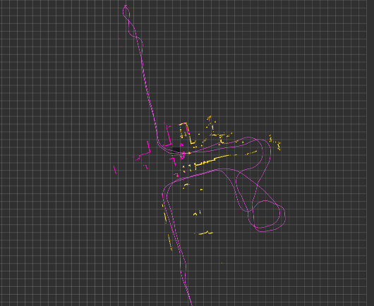
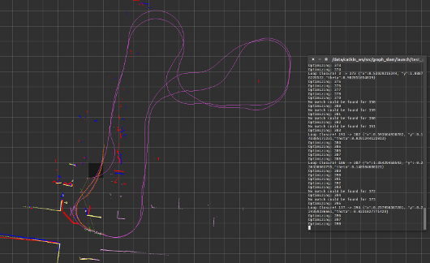
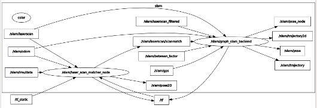

# ros_graph_slam
A ros graph slam backend using gtsam python.

## ROS implementation of graph slam using gtsam

This is a ros node to wrap the gtsam library into a ros node.



This node can be used in combination with a loop closure node.
To solve the loop closure slam problem.



## Installation

First clone it to your catkin_ws/src folder.

```bash
cd ~/catkin_ws/src
git clone git@github.com:penguinmenac3/ros_graph_slam.git graph_slam_backend
```

Then install and build the dependencies.
```bash
cd graph_slam_backend
sudo ./install_deps.sh
```

Finally build your catkin ws.
```bash
cd ~/catkin_ws
catkin_make
```

Have fun.

## Usage

There is a launchfile provided which launches the [scanmatcher](http://wiki.ros.org/laser_scan_matcher) and the graph_slam_backend.

```bash
roslaunch graph_slam_backend live.launch
```

You can see the nodegraph below.


